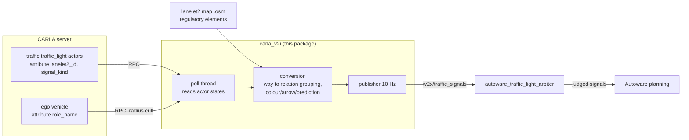

# carla_v2i — V2I traffic signal publisher for CARLA

`carla_v2i` lets an Autoware stack obey traffic lights in CARLA **without camera-based
recognition**. It reads the state of lanelet2-placed CARLA traffic lights over the CARLA
RPC API and republishes them as `autoware_perception_msgs/TrafficLightGroupArray`, which
`autoware_traffic_light_arbiter` accepts on its `external_traffic_signals` input. It is a
port of AWSIM's V2I / `V2IRos2Publisher`.

It is a standalone ROS 2 node that lives under `PythonAPI/util/`. It does not extend the
CARLA API, requires no engine changes, and is **read-only towards CARLA**: it never
modifies world or actor state.

> [!NOTE]
> This is unrelated to upstream CARLA's **V2X sensor family** (`sensor.other.v2x`,
> `sensor.other.v2x_custom`, the path-loss model and infrastructure V2I sensors), which
> models ETSI vehicle-to-vehicle messaging and delivers data through the sensor stream to a
> Python `listen()` callback. This node instead turns traffic light state into the Autoware
> signal message and publishes it on ROS 2. The topic name `/v2x/traffic_signals` comes from
> the Autoware side. Only the word overlaps; the two can coexist.

Verified end to end on the Odaiba map against a pilot-auto.x2 stack: the arbiter's judged
output carries the published group states, and the ego holds at a red light and departs on
green.

## How it fits together



Two inputs meet in this node. CARLA supplies **what each light is doing right now**; the
lanelet2 map supplies **which lights belong to the same regulatory element**, because
Autoware addresses signals by regulatory-element relation id, not by individual lamp. Each
CARLA light carries the way id it was placed from in its `lanelet2_id` attribute, and the
map tells us which ways a relation refers to.

## Requirements

| requirement | why |
|---|---|
| A running CARLA server with lanelet2-placed traffic lights | source of live signal state. Lights need the `lanelet2_id` attribute; lights without one are skipped (AWSIM parity) |
| The lanelet2 `.osm` of the same map | source of regulatory-element relation ids |
| A sourced Autoware workspace | supplies `rclpy` and `autoware_perception_msgs` |
| `lanelet2_traffic_light` on `PYTHONPATH` | sibling package under `PythonAPI/util/`, used to parse the map |

The CARLA Python API must be importable as well, as for any `PythonAPI/util` tool.

## Usage

```bash
source <autoware_ws>/install/setup.bash     # rclpy + autoware_perception_msgs
cd <repo>/PythonAPI/util
python3 -m carla_v2i --osm-path /path/to/lanelet2_map.osm \
    --ros-args -p use_sim_time:=true
```

Everything from `--ros-args` onward is handed to rclpy rather than to the node's own
argument parser.

> [!IMPORTANT]
> **`use_sim_time` is required whenever the consuming stack runs on `/clock`**, which is
> every CARLA `--ros2` end-to-end setup. `traffic_light_arbiter` discards external messages
> whose stamp differs from its own clock by more than `external_delay_tolerance` (5 s by
> default), so wall-clock stamps never ingest **and nothing reports an error**. Only a stack
> running on wall clock may omit it.

### Options

| option | default | meaning |
|---|---|---|
| `--osm-path` | (required) | lanelet2 map; source of regulatory-element relation ids |
| `--topic` | `/v2x/traffic_signals` | output topic. Confirm the arbiter's real input with `ros2 node info <arbiter>`; launch-file defaults sometimes name a topic nothing subscribes to |
| `--rate-hz` | `10.0` | publish rate |
| `--radius-m` | `150.0` | ego-distance culling (AWSIM parity): only lights within this radius of the ego are published, so distant groups stay unknown to Autoware. `<= 0` publishes every light and needs no ego |
| `--id-mode` | `relation` | group id space: `relation` (Autoware convention) or `way` (AWSIM `TrafficSignalId` parity) |
| `--ego-role-name` | `ego` | ego vehicle `role_name`; `hero` is always accepted as well |
| `--carla-host` / `--carla-port` | `localhost` / `2000` | CARLA RPC endpoint |
| `--prediction-steps` | `6` | future state transitions to predict (`0` disables) |

### Output

One `TrafficLightGroup` per regulatory element in range, published at `--rate-hz` with QoS
Reliable / Volatile / KeepLast(1).

* **Colour and shape.** The main lamp becomes a `CIRCLE` element. Arrow units become
  directional elements; the CARLA arrow bit mask carries a colour row and a direction, both
  of which are mapped to the Autoware `shape` enum.
* **Pedestrian lights.** CARLA renders pedestrian yellow as a blinking green. The node
  reports the semantic state, `GREEN` with status `FLASHING`, not the internal encoding.
* **Confidence** is always `1.0`: this is simulator ground truth.
* **Predictions.** For a light left on CARLA's autonomous cycle, the node walks the
  deterministic green/yellow/red table forward and attaches `predictions` with
  `information_source = SIMULATION`. Frozen lights and lights with a zero-length phase
  honestly report no predictions rather than guessing.

## Verifying the link

`verify_topic.py` subscribes for a few seconds and cross-checks every published group
against a fresh read of CARLA, printing `key=value` lines and a final verdict.

```bash
# freeze the lights first: with a cycling light the snapshot comparison can flake
python3 -c "import carla; carla.Client('localhost',2000).get_world().freeze_all_traffic_lights(True)"
python3 -m carla_v2i.verify_topic --osm-path /path/to/lanelet2_map.osm
```

```text
v2i_verify msgs=50 rate_hz=10.0 groups=12 expected_groups=12 mismatched=0
v2i_verify verdict=PASS rate_ok=True ids_ok=True sample_mismatch=[]
```

It checks three things: the publish rate is within 8-12 Hz, the set of group ids matches
what CARLA plus the map imply, and every group's elements match element for element.

## Coexistence with scenario_simulator_v2

scenario_simulator_v2's `V2ITrafficLights` publishes the same topics itself, so the two
publishers must not feed the arbiter at once.

* **Do not run this node alongside a scenario that declares `<id> v2i` signals.** Both
  sources write the arbiter input and conflict.
* Running inside a scenario_simulator_v2 stack is fine when the scenario declares **no**
  v2i signals: nothing registers on the simulator side, and this node is the only source
  on the arbiter input. Verified on the pilot-auto.x2 stack.
* Standalone CARLA use, whether the lights cycle autonomously or are driven through the
  Python API, works as before.

## Troubleshooting

| symptom | cause and fix |
|---|---|
| Autoware never reacts, yet the topic carries data | Stamps are on the wrong clock. Add `--ros-args -p use_sim_time:=true`. The arbiter drops late external messages silently. |
| Nothing subscribes to the topic | The arbiter's real input differs from the launch-file default. Read it with `ros2 node info <arbiter>` and pass `--topic`. |
| `v2i lights=0` at startup | The map has no lights carrying `lanelet2_id`, or the client connected before the episode state reached it. The node retries for 60 s; if a synchronous-mode owner such as a bridge has not started ticking yet, start this node afterwards. |
| `v2i ego not found` | No vehicle carries the expected `role_name`. Pass `--ego-role-name`, or `--radius-m 0` to publish every light without needing an ego. |
| All reads fail mid-run | The world was reloaded, so the actor handles are stale. Restart the node to rebuild them. |
| Group ids do not match Autoware's | Wrong id space. `relation` is the Autoware convention; `way` exists for AWSIM parity. |

## Implementation notes

* CARLA actor state reads cost roughly 7-10 ms per RPC call, so sweeping ~120 lights takes
  about a second, far longer than the 100 ms publish period. The CARLA poll therefore runs
  in a background thread and the ROS timer publishes the most recent snapshot. Pedestrian
  lights skip the arrow RPC, which saves about 40% of the calls.
* The `TrafficLightElement` constants are mirrored in `conversion.py` so that module stays
  free of ROS imports. The node asserts at startup that they still match the installed
  message definition, and refuses to run if they have drifted.
* `conversion.py` is pure and unit-tested (`tests/test_conversion.py`); it is the inverse of
  the decode mapping used by the scenario_simulator_v2 CARLA bridge.
